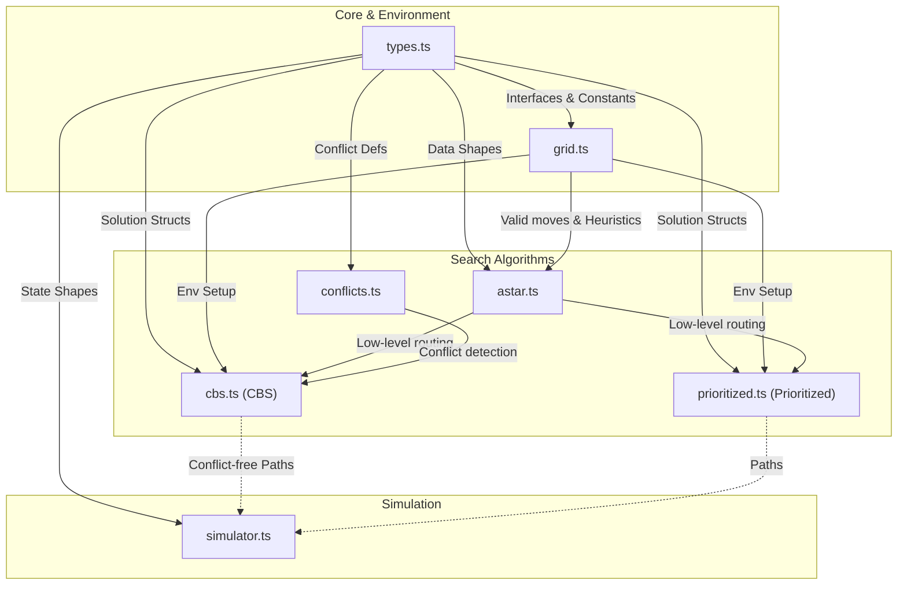

# MAPF Simulator Engine Architecture

This document provides a detailed breakdown of the `src/lib` architecture and illustrates how all the components piece together.

## Architecture Overview

The Map-Agent Pathfinding (MAPF) simulator is built with a clean separation of concerns. It is divided into three core pillars:

1. **Data & Environment (`types.ts`, `grid.ts`)**: Defines the fundamental elements like the grid layout, agent definitions, boundaries, and movement rules.
2. **Search Algorithms (`astar.ts`, `conflicts.ts`, `cbs.ts`, `prioritized.ts`)**: The brain of the simulator. It separates low-level pathfinding for single agents (A*) and high-level routing coordination for multiple agents acting dynamically across space and time to resolve physical conflicts with each other.
3. **Simulation Engine (`simulator.ts`)**: The execution step. It accepts optimal paths solved by the search layers and steps through them to manage real-time positioning and simulation logic.

## Dependency Flow Diagram

## File Breakdown

Here is what each file in the `src/lib` folder is specifically responsible for:

- **`types.ts`**: The foundational backbone of the module. It defines TypeScript interfaces to type the entire simulator (`Agent`, `Position`, `Solution`, `PathStep`, `Conflict`, `Constraint`). It ensures type-safety, encapsulates space-time keys, and defines possible agent movements (up, down, left, right, wait).
- **`grid.ts`**: Contains environment utilities. It exposes functions for building the base grid, adding obstacles, bounds-checking (to determine walkable cells and available neighbors for pathfinding), evaluating base heuristics (like Manhattan Distance), and randomly placing valid start/goal grids for scenarios.
- **`astar.ts`**: Implements **Space-Time A***, the foundational *low-level* search algorithm. Unlike a conventional A* that finds the shortest physical route, this implementation treats time as a coordinate (moving through $x$, $y$, and $t$). It accepts "constraints" and returns single-agent pathways avoiding designated squares at specific physical ticks.
- **`conflicts.ts`**: Dedicated strictly to geometry rule-checking over time. It scans through map pathways and flags situations where agents mathematically bump. It detects both **Vertex Conflicts** (two agents entering the same square at the same timestamp) and **Edge Conflicts** (two agents simultaneously swapping positions, moving through each other).
- **`cbs.ts`**: Implements **Conflict-Based Search (CBS)**, an optimal, complete MAPF algorithm. It uses a high-level constraint tree to find the perfect solution: running `astar.ts` originally for each agent, utilizing `conflicts.ts` to locate physical anomalies, branching constraints continuously to forbid overlapping timesteps for colliding elements, and repeatedly running `astar.ts` until zero overlaps remain across the grid map.
- **`prioritized.ts`**: A faster, deterministic, but slightly sub-optimal pathing alternative to `cbs`. It routes agents one-by-one by assigning priority. An agent plans an `astar.ts` route without observing future agents, and all newly-committed moves simply act as physical constraints for whoever iterates next, turning leading agents into moving temporal obstacles.
- **`simulator.ts`**: Processes the results. Operating independently of routing logic, this simulation engine takes in solved agent paths (`PathStep[]`) and steps them sequentially frame by frame. It keeps track of the active timeline, tracks previous/current agent coordinates across frames natively, and manages logic for agents completing their goals (using the disappear-at-goal model).
